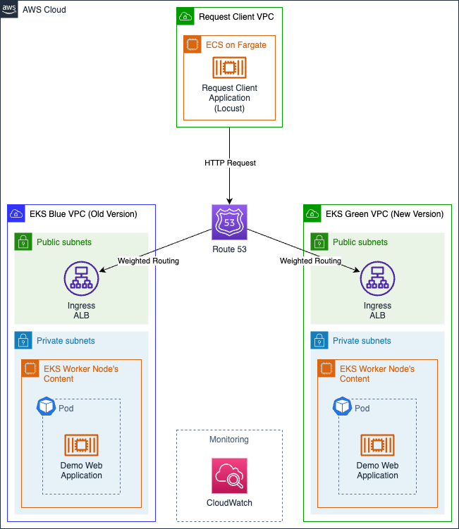
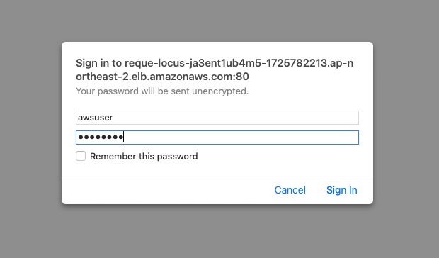
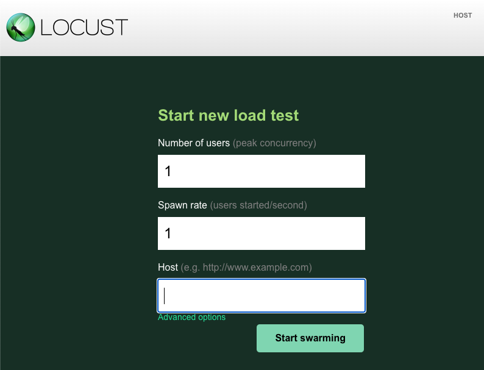
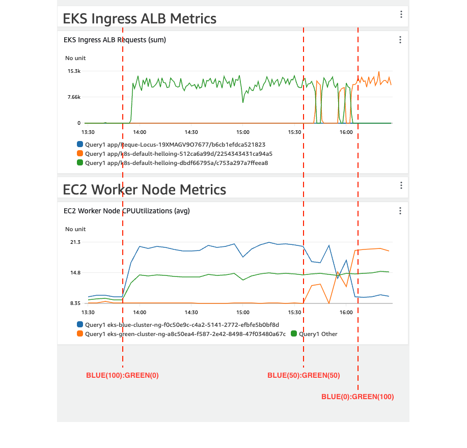

# AWS EKS Cluster Upgrade with Blue/Green Strategy with AWS CDK

[](/README.md) [](/README-KR.md)

이 프로젝트를 통해 Route53 가중치 라우팅 기능을 활용한 AWS EKS 클러스터 블루/그린 업그레이드 실습을 진행할 수 있습니다.
해당 데모는 블루/그린 전략을 통해 AWS EKS 클러스터를 업그레이드 하고자 하는 DevOps 엔지니어에게 도움을 주기 위해 제작되었습니다.

- [What is Blue/Green Strategy?](/WHAT-IS-BLUE-GREEN-KR.md)

해당 데모는 서울 리전(`ap-northeast-2`)을 기반으로 합니다. 

## Demo Architecture



## Quick Start

### 0. Pre-Requisites
- **네임서버 설정이 가능한** 본인 소유의 도메인이 필요합니다.
- [AWS Account](https://aws.amazon.com/resources/create-account/) : AWS 계정을 생성하고 [AdministratorAccess 권한](https://docs.aws.amazon.com/IAM/latest/UserGuide/getting-set-up.html#create-an-admin)을 해당 계정의 유저에 설정해주세요. 해당 유저의 권한은 데모에 필요한 VPC, EKS, ALB 와 같은 AWS 리소스를 프로비저닝 하기 위해 필요합니다.
- [AWS CLI](https://docs.aws.amazon.com/cli/latest/userguide/getting-started-install.html) : AWS CLI를 설치하고, 데모를 수행할 PC에 [aws credentials 정보를 설정](https://docs.aws.amazon.com/cli/latest/userguide/cli-configure-files.html#cli-configure-files-format)합니다.
- [AWS CDK](https://docs.aws.amazon.com/cdk/v2/guide/getting_started.html#getting_started_install)
- [docker](https://docs.docker.com/engine/install/)
- [npm](https://nodejs.org/ko/download)
- [kubectl](https://kubernetes.io/docs/tasks/tools/#kubectl)
- [git](https://git-scm.com/book/en/v2/Getting-Started-Installing-Git)

### 1. Clone this project and modify some code for the demo.
*1-1.* `git clone` 명령을 통해 해당 프로젝트를 로컬 pc에 가져옵니다.
```bash
git clone git@github.com:aws-samples/eks-cluster-upgrade-with-a-blue-green-strategy.git
```

*1-2.* 데모에서 **본인 소유의 도메인**을 활용하기 위해 아래 코드에서 도메인 값을 변경합니다.
- [public-hosted-zone-stack.ts](/aws-cdks/my-eks-blueprints/lib/public-hosted-zone-stack.ts#L9) : `HostedZoneName` 변수의 값을 수정합니다.
- [demo-application-blue.yaml](/aws-cdks/my-eks-blueprints/lib/utils/manifests/demo-application-blue.yaml#L46) & [demo-application-green.yaml](/aws-cdks/my-eks-blueprints/lib/utils/manifests/demo-application-green.yaml#L46) : `external-dns.alpha.kubernetes.io/hostname` 어노테이션의 값을 수정합니다.

*1-3.* 네트워크 부하 발생 도구([Locust](https://locust.io/))의 대시보드 접속 정보를 업데이트 합니다.
- [my-eks-blueprints](/aws-cdks/my-eks-blueprints/bin/my-eks-blueprints.ts#L19-L21)
  - `allowedCidrs` : Locust 대시보드에 접속할 때 접속을 허용할 CIDR 주소 범위를 설정합니다.
  - `webUsername` 및 `webPassword` : Locust 대시보드에 로그인 할 때 사용할 계정 정보를 설정합니다.

### 2. Setup CDK and Deploy CDK Stack
```bash
cd aws-cdks/my-eks-blueprints/
npm install
cdk bootstrap
cdk synth
cdk deploy --all
```

터미널을 통해 프로비저닝 된 각 CDK Stack을 확인하고, 질문에 `y`를 입력합니다. 
이 작업을 통해 데모 아키텍처를 프로비저닝 합니다. 모든 아키텍처가 프로비저닝 완료되기까지 **약 15~30분** 정도가 소요됩니다.

### 3. Set up nameservers for your domain
전체 CDK Stack이 프로비저닝 완료되면, Route53에 생성된 Public hosted zone을 참조하여 도메인 네임서버 설정을 변경합니다.

### 4. Continuous HTTP request load for EKS clusters
브라우저를 통해 네트워크 부하 발생 도구(Locust)의 대시보드에 접속합니다. 이 때 접속 해야 할 엔드포인트는 `request-client` Stack을 프로비저닝 할 때 생성되는 Application Load Balancer의 엔드포인트 입니다. 
[1번째 단계](#1-clone-this-project-and-modify-some-code-for-the-demo)에서 설정한 계정 정보를 통해 대시보드에 접속합니다. 그 다음, `Host`에 지정한 도메인을 기입하고 `Start swarming` 버튼을 클릭하여 트래픽을 발생시킵니다.





### 5. Modify weighted traffic values for EKS cluster switching
Route53 가중치 라우팅 기능을 통해 블루 클러스터 및 그린 클러스터로 흐르는 트래픽의 가중치 값을 조절합니다.
아래와 같은 예시로 가중치 값을 조정하면 점진적으로 블루 클러스터에서 그린 클러스터로 트래픽을 전환할 수 있습니다.
- 1차 : `블루(80%):그린(20%)`
- 2차 : `블루(50%):그린(50%)`
- 3차 : `블루(20%):그린(80%)`
- 최종 : `블루(0%):그린(100%)`

참고로 초기 가중치 값은 `블루(100%):그린(0%)` 으로 설정되어 있습니다.

가중치 값은 [demo-aplication-blue.yaml](/aws-cdks/my-eks-blueprints/lib/utils/manifests/demo-application-blue.yaml#L47) 및 [demo-application-green.yaml](/aws-cdks/my-eks-blueprints/lib/utils/manifests/demo-application-green.yaml#L47) 내의 `external-dns.alpha.kubernetes.io/aws-weight` 어노테이션의 값을 수정하여 조정할 수 있습니다. 값은 백분율로 맞춰 입력합니다.

코드의 가중치 값을 수정한 후, CDK Stack을 재배포하여 Route53 레코드의 가중치 라우팅 설정을 업데이트 합니다.
```bash
cd aws-cdks/my-eks-blueprints/
cdk deploy --all
```

롤백의 경우, 반대로 `블루(100%):그린(0%)` 으로 가중치 값을 업데이트 합니다.

### 6. Monitoring network traffic with CloudWatch Dashboard

CloudWatch 콘솔로 접속 후 `EKS_Monitoring_Dashboard`라는 이름의 CloudWatch 대시보드를 참조하여 가중치 값을 변경하는 과정에서 정상적으로 동작되는지 모니터링 합니다.



## Clean-up
실습 환경을 제거하려면 아래 명령을 수행합니다.
```bash
cd aws-cdks/my-eks-blueprints/
cdk destroy --all
```

## Security
See [CONTRIBUTING](/CONTRIBUTING.md) for more information.

## License
This library is licensed under the MIT-0 License. See the [LICENSE](/LICENSE) file.