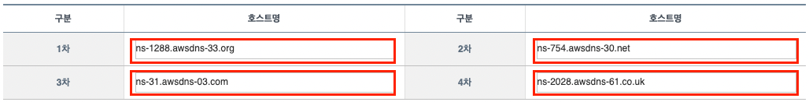
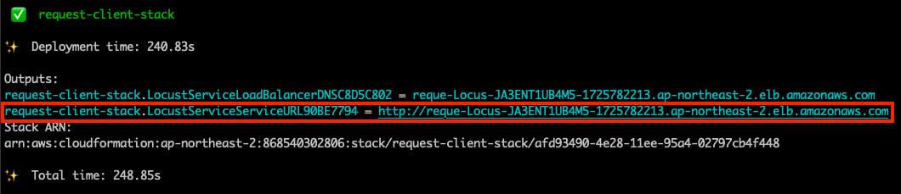
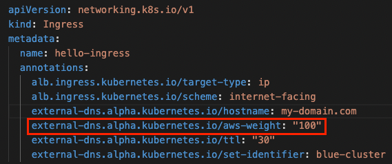

# AWS EKS Cluster Upgrade with Blue/Green Strategy with AWS CDK

[](/README.md) [](/README-KR.md)

이 프로젝트를 통해 Route53 가중치 라우팅 기능을 활용한 AWS EKS 클러스터 블루/그린 업그레이드 실습을 진행할 수 있습니다.
해당 데모는 블루/그린 전략을 통해 AWS EKS 클러스터를 업그레이드 하고자 하는 DevOps 엔지니어에게 도움을 주기 위해 제작되었습니다.

블루/그린 전략에 대해서 궁금하실 경우, 아래 링크를 참조해주세요.
- [블루/그린 전략이란?](/WHAT-IS-BLUE-GREEN-KR.md)

해당 데모는 서울 리전(`ap-northeast-2`)을 기반으로 합니다. 

## Demo Architecture


## Quick Start

### 실습 전 유의사항 (필독)
- **네임서버 변경이 가능한 도메인**이 꼭 필요합니다.
- 해당 데모에서는 free-tier에 포함되지 않은 리소스도 일부 사용하므로 데모 시작 시 **일부 비용이 발생** 될 수 있습니다.
- 해당 데모에서는 **새로운 VPC를 3개 생성**합니다. 따라서 **서비스 할당량**에 제한되지 않도록 미리 VPC 서비스의 할당량에 여유가 있는 상태인지 확인이 필요합니다.
- 새로운 3개의 VPC는 각각 `172.51.0.0/16`, `172.61.0.0/16`, `10.100.0.0/24` 의 **CIDR 주소 범위**를 사용하므로, 데모 실습 환경에서 **해당 CIDR 주소 범위와 겹치는 환경이 없어야 합니다.** 만약 기존에 운영중인 환경이 해당 CIDR 주소 범위와 겹칠 경우, 일부 코드를 수정하여 실습 환경이 운영중인 워크로드에 영향을 주지 않도록 해야 합니다.
  - CIDR 주소를 수정하는 방법
    - EKS 클러스터의 CIDR 주소 범위를 수정하려면 [my-eks-blueprints.ts](/aws-cdks/my-eks-blueprints/bin/my-eks-blueprints.ts#L86,L149) 파일을 참조하세요.
      - 
      - 
    - Request Client의 CIDR 주소 범위를 수정하려면 [request-client-stack.ts](/aws-cdks/my-eks-blueprints/lib/request-client-stack.ts#L20) 파일을 참조하세요.
      - 
- 실습 환경으로 인해 운영중인 워크로드에 영향이 가지 않도록 **실습에서 사용되는 서브도메인을 확인**해야 합니다. 데모에서는 이를 위해 기본적으로 `weighted` 라는 이름의 서브도메인을 붙여 요청을 수신하도록 프로그래밍 되어있습니다.(예: `weighted.example.com`) 만약 실습을 위해 다른 서브도메인을 사용하고 싶다면 일부 코드를 수정해야 합니다.
  - [실습에서 사용되는 서브도메인을 변경하는 방법](#reasons-for-using-weighted-subdomains)

### 0. Pre-Requisites
- **네임서버 설정이 가능한** 본인 소유의 도메인이 필요합니다.
- [AWS Account](https://aws.amazon.com/resources/create-account/)
  - AWS 계정을 생성하고 [AdministratorAccess 권한](https://docs.aws.amazon.com/IAM/latest/UserGuide/getting-set-up.html#create-an-admin)을 해당 계정의 유저에 설정해주세요. 
  - 해당 유저의 권한은 데모에 필요한 VPC, EKS, ALB 와 같은 AWS 리소스를 프로비저닝 하기 위해 필요합니다.
- [AWS CLI](https://docs.aws.amazon.com/cli/latest/userguide/getting-started-install.html)
  - AWS CLI를 설치하고, 데모를 수행할 PC에 [aws credentials 정보를 설정](https://docs.aws.amazon.com/cli/latest/userguide/cli-configure-files.html#cli-configure-files-format)합니다.
- [AWS CDK](https://docs.aws.amazon.com/cdk/v2/guide/getting_started.html#getting_started_install)
- [docker](https://docs.docker.com/engine/install/)
  - 원활한 데모 실습을 위해서는 실습 장비에 Docker Daemon이 실행되어 있어야 합니다.
  - Docker Daemon이 실행되고 있지 않을 경우, 아래와 같은 에러가 발생할 수 있습니다.
    ```bash
    ERROR: Cannot connect to the Docker daemon at unix:///var/run/docker.sock. Is the docker daemon running?
    ```
- [npm](https://nodejs.org/ko/download)
- [kubectl](https://kubernetes.io/docs/tasks/tools/#kubectl)
- [git](https://git-scm.com/book/en/v2/Getting-Started-Installing-Git)

### 1. Clone this project and setting environment variables for the demo.
*1-1.* `git clone` 명령을 통해 해당 프로젝트를 로컬 pc에 가져옵니다.
```bash
git clone git@github.com:aws-samples/eks-cluster-upgrade-with-a-blue-green-strategy.git
```

<br>

*1-2.* 데모에서 **본인 소유의 도메인**을 활용하기 위해 터미널에서 아래 명령과 같이 환경변수를 정의합니다.
```bash
export CDK_HOSTED_ZONE_NAME=<본인 소유의 도메인>
```

환경변수가 정상적으로 정의되었는지 아래 명령을 통해 확인합니다.
```bash
echo $CDK_HOSTED_ZONE_NAME
```

<br>

*1-3.* **Route53에 도메인에 대한 Public hosted zone이 이미 구성되어 있고, 해당 Public hosted zone을 실습에 활용하고자 할 경우** 아래 명령과 같이 환경변수를 정의합니다.
```bash
export CDK_IS_HOSTED_ZONE_ALREADY_EXISTS=true
```

반대로 **Route53에 도메인에 대한 Public hosted zone이 구성되어 있지 않을 경우**, 새로운 Public hosted zone을 생성하기 위해 아래 명령과 같이 환경변수를 정의합니다.
```bash
export CDK_IS_HOSTED_ZONE_ALREADY_EXISTS=false
```

환경변수가 정상적으로 정의되었는지 아래 명령을 통해 확인합니다.
```bash
echo $CDK_IS_HOSTED_ZONE_ALREADY_EXISTS
```

별도로 환경변수를 설정하지 않을 경우 기본적으로 새로운 Public hosted zone을 생성합니다.

만약 Public hosted zone이 구성되어 있지 않은 상태에서 `CDK_IS_HOSTED_ZONE_ALREADY_EXISTS` 환경변수를 **true**로 설정했을 경우 에러가 발생합니다.

<br>

*1-4.* 이 데모에서는 오픈소스 부하 테스트 도구인 Locust를 사용하여 사용자 트래픽을 생성해 보겠습니다. Route53의 블루 클러스터에서 그린 클러스터로 가중치 기반 트래픽을 수정하면서 CloudWatch를 사용하여 EKS Ingress 요청을 지속적으로 모니터링할 예정입니다.

Locust는 대시보드 GUI를 위한 사용자 이름과 비밀번호를 필요로 합니다. Request Client 대시보드에 로그인하는 데 필요한 관리자 계정 정보는 아래와 같이 환경 변수로 정의됩니다.

**Request Client 대시보드에 로그인 할 계정 정보**를 아래와 같이 환경변수로 정의합니다.
```bash
export CDK_REQUEST_CLIENT_USERNAME=<계정명>
export CDK_REQUEST_CLIENT_PASSWORD=<비밀번호>
```

환경변수가 정상적으로 정의되었는지 아래 명령을 통해 확인합니다.
```bash
echo $CDK_REQUEST_CLIENT_USERNAME
echo $CDK_REQUEST_CLIENT_PASSWORD
```

별도로 계정 정보를 설정하지 않을 경우 username은 `awsuser`로, password는 `passw0rd`로 기본 설정됩니다.

### 2. Setup CDK and Deploy CDK Stack
```bash
cd aws-cdks/my-eks-blueprints/
npm install
cdk bootstrap
cdk synth
cdk deploy --all
```

터미널을 통해 프로비저닝 된 각 CDK Stack을 확인하고, 질문에 `y`를 입력합니다. 
이 작업을 통해 데모 아키텍처를 프로비저닝 합니다. 모든 아키텍처가 프로비저닝 완료되기까지 **약 15~30분** 정도가 소요됩니다.

### 3. Set up nameservers for your domain
전체 CDK Stack이 프로비저닝 완료되면, Route53에 생성된 Public hosted zone을 참조하여 도메인 네임서버 설정을 변경합니다.

*3-1.* **Route 53 콘솔**에서 **도메인의 Public hosted zone을 선택**합니다. 선택한 Public hosted zone의 **네임서버 정보를 확인**합니다.


*3-2.* 그 다음, 도메인을 구매한 사이트에 접속하여 **네임서버 정보를 업데이트** 합니다.



도메인의 네임 서버를 업데이트 하는 방법은 도메인을 구매한 사이트에서 확인해야 합니다.

### 4. Continuous HTTP request load for EKS clusters
브라우저를 통해 Request Client의 대시보드에 접속합니다. 이 때 접속 해야 할 엔드포인트는 `request-client` Stack을 프로비저닝 할 때 생성되는 Application Load Balancer의 엔드포인트 입니다. 



[1번째 단계](#1-clone-this-project-and-setting-environment-variables-for-the-demo)에서 설정한 계정 정보를 통해 대시보드에 접속합니다.


아래는 로그인 후 대시보드에 접속한 초기 화면입니다.


그 다음, `Host`에 지정한 도메인을 기입합니다. 
이 때, `http://weighted.<지정한 도메인>` 형식으로 `weighted` 서브도메인을 붙여서 입력합니다.


#### Reasons for using weighted subdomains

도메인에 `weighted` 라는 서브도메인을 추가한 이유는, 실습으로 인해 계정의 운영 워크로드에 영향이 가지 않도록 하기 위함입니다.
[deploy-demo-application.ts](/aws-cdks/my-eks-blueprints/lib/utils/deploy-demo-application.ts#L23-L25) 코드를 확인하면 ingress manifest 내에 `external-dns.alpha.kubernetes.io/hostname` 어노테이션 값을 `weighted` 라는 서브도메인이 추가된 도메인으로 변경하는 코드를 확인할 수 있습니다.

대부분의 운영 워크로드에서는 `weighted`를 서브도메인으로 사용하지 않기 때문에 해당 데모에서는 기본적으로 `weighted` 서브도메인을 사용하도록 코드를 작성했습니다.
만약 별도의 서브도메인을 사용하도록 수정하고 싶다면, [deploy-demo-application.ts](/aws-cdks/my-eks-blueprints/lib/utils/deploy-demo-application.ts#L23) 코드 내의 `weightedDomain` 변수를 참고하여 원하는 서브도메인을 사용하도록 코드를 수정하세요.


마지막으로 `Start swarming` 버튼을 클릭하여 트래픽을 발생시킵니다.
 
트래픽이 정상적으로 발생되면 아래와 같이 Charts 탭에서 그래프를 확인할 수 있습니다.


### 5. Modify weighted traffic values for EKS cluster switching
Route53 가중치 라우팅 기능을 통해 블루 클러스터 및 그린 클러스터로 흐르는 트래픽의 가중치 값을 조절합니다.
아래와 같은 예시로 가중치 값을 조정하면 점진적으로 블루 클러스터에서 그린 클러스터로 트래픽을 전환할 수 있습니다.
- 1차 : `블루(80%):그린(20%)`
- 2차 : `블루(50%):그린(50%)`
- 3차 : `블루(20%):그린(80%)`
- 최종 : `블루(0%):그린(100%)`

참고로 초기 가중치 값은 `블루(100%):그린(0%)` 으로 설정되어 있습니다.

가중치 값은 [demo-aplication-blue.yaml](/aws-cdks/my-eks-blueprints/lib/utils/manifests/demo-application-blue.yaml#L47) 및 [demo-application-green.yaml](/aws-cdks/my-eks-blueprints/lib/utils/manifests/demo-application-green.yaml#L47) 내의 `external-dns.alpha.kubernetes.io/aws-weight` 어노테이션의 값을 수정하여 조정할 수 있습니다. 값은 백분율로 맞춰 입력합니다.




코드의 가중치 값을 수정한 후, CDK Stack을 재배포하여 Route53 레코드의 가중치 라우팅 설정을 업데이트 합니다.
```bash
cd aws-cdks/my-eks-blueprints/
cdk deploy --all
```

롤백의 경우, 반대로 `블루(100%):그린(0%)` 으로 가중치 값을 업데이트 합니다.

### 6. Monitoring network traffic with CloudWatch Dashboard

CloudWatch 콘솔로 접속 후 `EKS_Monitoring_Dashboard`라는 이름의 CloudWatch 대시보드를 참조하여 가중치 값을 변경하는 과정에서 정상적으로 동작되는지 모니터링 합니다.


## Clean-up
실습 환경을 제거하려면 아래 명령을 수행합니다.
```bash
cd aws-cdks/my-eks-blueprints/
cdk destroy --all
```

## Security
See [CONTRIBUTING](/CONTRIBUTING.md) for more information.

## License
This library is licensed under the MIT-0 License. See the [LICENSE](/LICENSE) file.