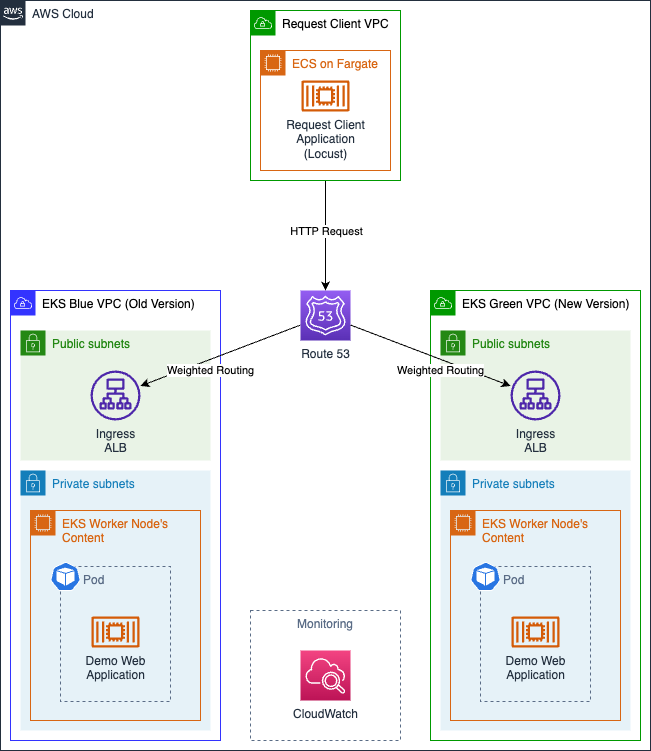
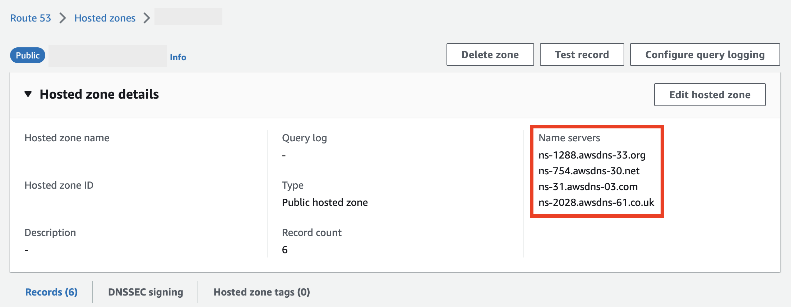
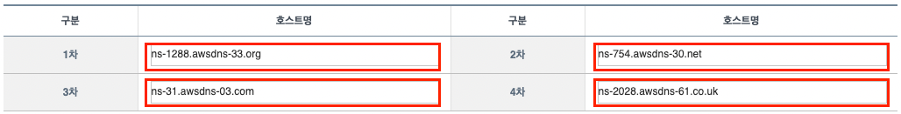
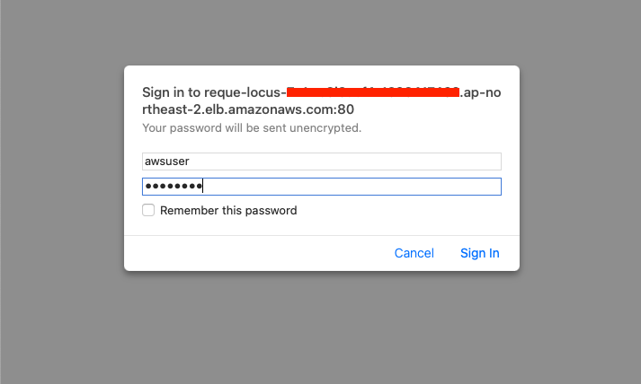
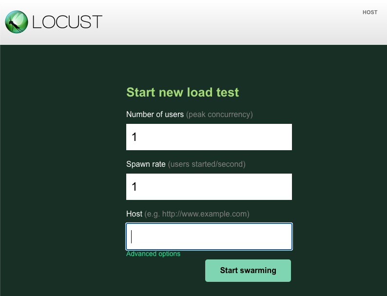
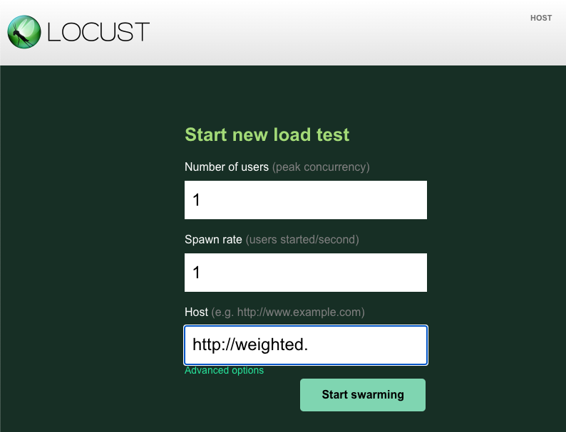
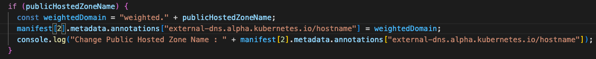
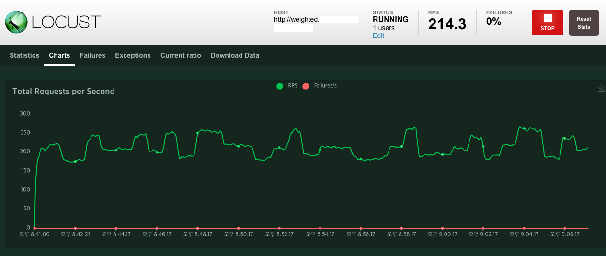
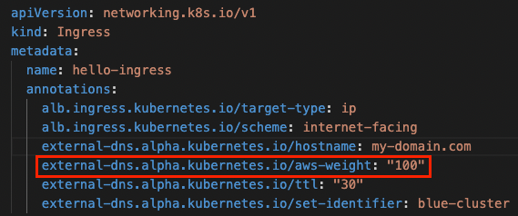
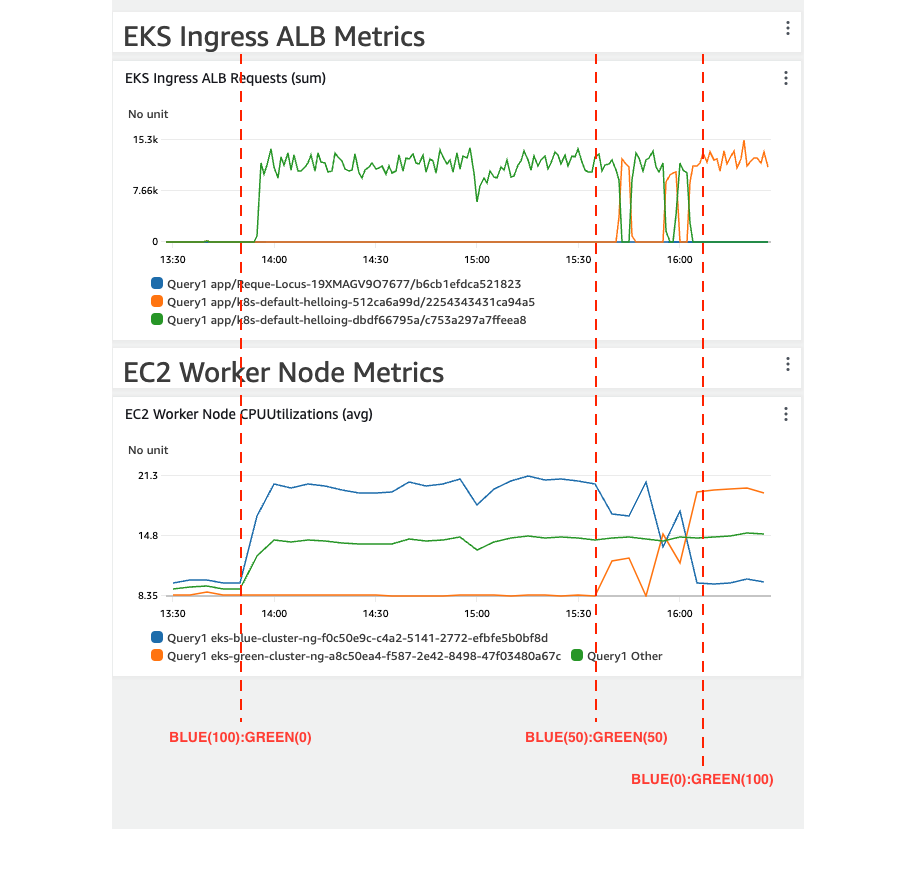

# AWS EKS Cluster Upgrade with Blue/Green Strategy with AWS CDK

[](/README.md) [](/README-KR.md)

This project enables you to provision the infrastructure and demo web application required for the AWS EKS Cluster Blue/Green Upgrade lab. This demo is designed to help DevOps engineers who want to upgrade their AWS EKS cluster with a blue/green strategy.

- [What is Blue/Green Strategy?](/WHAT-IS-BLUE-GREEN.md)

This demo is based on the `ap-northeast-2`. (Seoul region)

## Demo Architecture



## Quick Start

### 0. Pre-Requisites
- You'll need your own domain with **name-servers configurable**.
- [AWS Account](https://aws.amazon.com/resources/create-account/)
  - Create an AWS account and set the [AdministratorAccess](https://docs.aws.amazon.com/ko_kr/IAM/latest/UserGuide/getting-set-up.html#create-an-admin) permission to a user in that account. 
  - The user's permissions are required to provision AWS resources such as VPCs, EKS, and ALBs required for the demo.
- [AWS CLI](https://docs.aws.amazon.com/cli/latest/userguide/getting-started-install.html)
  - Install the AWS CLI, and [set up the aws credentials](https://docs.aws.amazon.com/cli/latest/userguide/cli-configure-files.html#cli-configure-files-format) on the PC where you want to perform the demo.
- [AWS CDK](https://docs.aws.amazon.com/cdk/v2/guide/getting_started.html#getting_started_install)
- [docker](https://docs.docker.com/engine/install/)
  - For a smooth demo, the lab equipment must have the Docker Daemon running.
  - If Docker Daemon is not running, the following errors may occur
    ```bash
    ERROR: Cannot connect to the Docker daemon at unix:///var/run/docker.sock. Is the docker daemon running?
    ```
- [npm](https://nodejs.org/ko/download)
- [kubectl](https://kubernetes.io/docs/tasks/tools/#kubectl)
- [git](https://git-scm.com/book/en/v2/Getting-Started-Installing-Git)

### 1. Clone this project and setting environment variables for the demo.
*1-1.* Clone that project to your local PC with the `git clone` command.
```bash
git clone git@github.com:aws-samples/eks-cluster-upgrade-with-a-blue-green-strategy.git
```

<br>

*1-2.* To utilize **your own domain** in the demo, define environment variables in the terminal as shown in the command below.
```bash
export CDK_HOSTED_ZONE_NAME=<domain>
```

Use the following command to check if the environment variable has been defined correctly.
```bash
echo $CDK_HOSTED_ZONE_NAME
```

<br>

*1-3.* **If a public hosted zone for the domain is already configured in Route53 and you want to use that public hosted zone for demo**, define the environment variables as shown in the following command.
```bash
export CDK_IS_HOSTED_ZONE_ALREADY_EXISTS=true
```

**If Route53 does not have a public hosted zone configured for the domain**, define an environment variable as shown in the following command to create a new public hosted zone.
```bash
export CDK_IS_HOSTED_ZONE_ALREADY_EXISTS=false
```

Use the following command to check if the environment variable has been defined correctly.
```bash
echo $CDK_IS_HOSTED_ZONE_ALREADY_EXISTS
```

If you don't set an environment variable, a new public hosted zone will be created by default.

If a public hosted zone does not exist but the `CDK_IS_HOSTED_ZONE_ALREADY_EXISTS` environment variable is set to **true**, an error will occur.

<br>

*1-4.* **Account information to sign-in to the Request Client dashboard** is defined as an environment variable as shown below.
```bash
export CDK_REQUEST_CLIENT_USERNAME=<username>
export CDK_REQUEST_CLIENT_PASSWORD=<password>
```

Use the following command to check if the environment variable has been defined correctly.
```bash
echo $CDK_REQUEST_CLIENT_USERNAME
echo $CDK_REQUEST_CLIENT_PASSWORD
```

If you do not set account information separately, the username is set to `awsuser` and the password is set to `passw0rd` by default.

### 2. Setup CDK and Deploy CDK Stack
```bash
cd aws-cdks/my-eks-blueprints/
npm install
cdk bootstrap
cdk synth
cdk deploy --all
```
Please check for each stack provisioned through the terminal and type `y` to the question.
Through this task, provision [the architecture shown in the figure above](#demo-architecture). It takes approximately **15-30 minutes**.

### 3. Set up nameservers for your domain
Once the entire CDK Stack is provisioned, refer to the Public hosted zone created on Route53 to change the domain nameserver settings.

*3-1.* From the **Route 53 Console**, select **Public hosted zone**. Next, check the **Name servers** information for the selected public hosted zone.



*3-2.* Next, go to the site where you purchased the domain and **update the name server information**.



How to update a domain's name servers must be checked on the site where the domain was purchased.

### 4. Continuous HTTP request load for EKS clusters
Access the dashboard of the Network Load Balancer (Locust) through a browser. The endpoint you need to connect to is the endpoint of the Application Load Balancer, which is created when provisioning the `request-client` Stack. 


Access the dashboard with the account information you set up in [step 1](#1-clone-this-project-and-setting-environment-variables-for-the-demo). 



If you log in and access the dashboard, you can see the following screen.



Next, enter the domain you specified in `Host`.

When entering Host, add `http://` and `weighted` prefix.

Below is an example : 
- `http://weighted.my-domain.com`



The reason for adding a `weighted` prefix to the domain is to prevent the demo from affecting the production workloads.

In the [deploy-demo-application.ts](/aws-cdks/my-eks-blueprints/lib/utils/deploy-demo-application.ts#L23-L25), you can see the code that changes the value of the `external-dns.alpha.kubernetes.io/hostname` annotation in the ingress manifest to the domain with the `weighted` prefix added.

Since most production workloads don't use `weighted` as a prefix, this demo used `weighted` prefix.

If you want to specify a separate prefix, refer to the `weightedDomain` variable in the [deploy-demo-application.ts](/aws-cdks/my-eks-blueprints/lib/utils/deploy-demo-application.ts#L23) code and modify it to the desired value.



Next, click the `Start swarming` button to start generating traffic.

If traffic is generated normally, you can check the graph in the Charts tab as shown below.



### 5. Modify weighted traffic values for EKS cluster switching
The Route53 weighted routing feature adjusts the weight value of traffic flowing to the blue and green clusters.
As shown in the example below, you can adjust the weight values to gradually shift traffic from the blue cluster to the green cluster.
- 1st : `BLUE(80%):GREEN(20%)`
- 2nd : `BLUE(50%):GREEN(50%)`
- 3rd : `BLUE(20%):GREEN(80%)`
- finally : `BLUE(0%):GREEN(100%)`

Note that the initial weighting values are set to `BLUE(100%):GREEN(0%)`.

The weight value can be adjusted by modifying the value of the `external-dns.alpha.kubernetes.io/aws-weight` annotation within [demo-aplication-blue.yaml](/aws-cdks/my-eks-blueprints/lib/utils/manifests/demo-application-blue.yaml#L47) and [demo-application-green.yaml](/aws-cdks/my-eks-blueprints/lib/utils/manifests/demo-application-green.yaml#L47). The value is entered as a percentage.



After modifying the weight values in the code, redeploy the CDK Stack to update the weighted routing settings for the Route53 record.

```bash
cd aws-cdks/my-eks-blueprints/
cdk deploy --all
```

For rollbacks, you can do the opposite and update the weight values to `BLUE(100%):GREEN(0%)`.

### 6. Monitoring network traffic with CloudWatch Dashboard

Go to the CloudWatch console and refer to the CloudWatch dashboard named `EKS_Monitoring_Dashboard` to monitor the process of changing the weight value to make sure it works properly.



## Clean-up
```bash
cd aws-cdks/my-eks-blueprints/
cdk destroy --all
```

## Security
See [CONTRIBUTING](/CONTRIBUTING.md#security-issue-notifications) for more information.

## License
This library is licensed under the MIT-0 License. See the [LICENSE](/LICENSE) file.